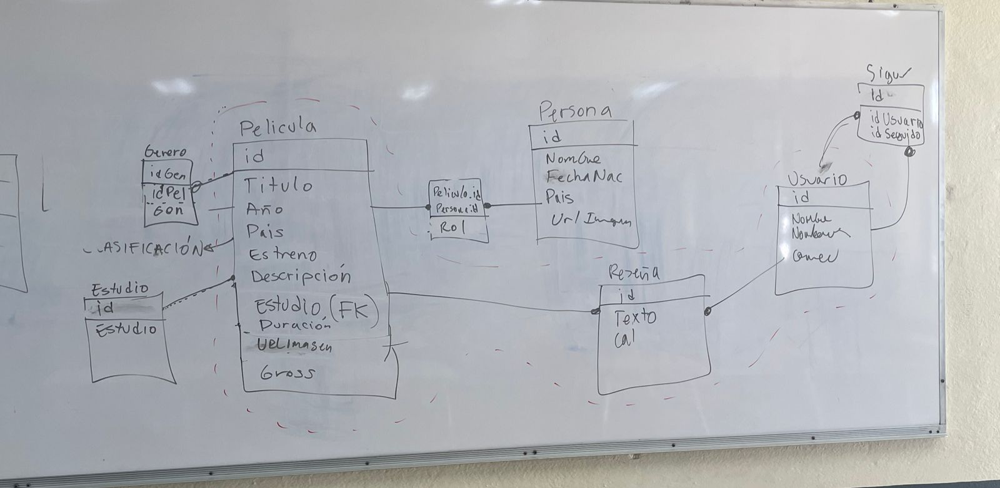

# MoviesProyect
Proyecto num.2 de paginas web.
En este proyecto desarrollaremos una aplicacion web utilizando el framework Django, Python, tailwinds, Posgrest y los servidores de AWS para cargar la pagina. 
Utilizaremos la siguiente base de datos: 

## El proyecto consiste en:

1. Implementar mínimo el modelo que se muestra dentro de las líneas punteadas en la imágen.
2. Una página principal donde se muestren las películas más recientes.
3. Una página para votar y/o reseñar una película.
4. Una sección dónde se muestren varias películas recomendadas.
5. Se debe implementar un algoritmo de recomendación, por ejemplo, uno de filtrado colaborativo.
6. Una página para ver el detalle de una película.
7. Una página para ver el detalle de un actor.

## Detalles

* La aplicación se desarrollará en equipo.
* Se debe tener una instancia en AWS para mostrar la página.
* Debe estar disponible en un repositorio de GitHub.
* Se debe grabar un video de ~5 minutos explicando el proyecto.
* El repo debe tener issues e integrantes asignados a las tareas.

### API

Vamos a utilizar el API del sitio [TMDB](https://developer.themoviedb.org)

Fecha de entrega: 22 de octubre.
